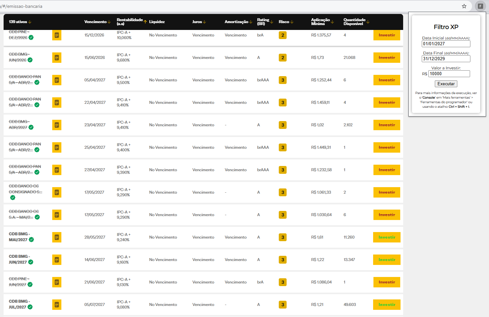
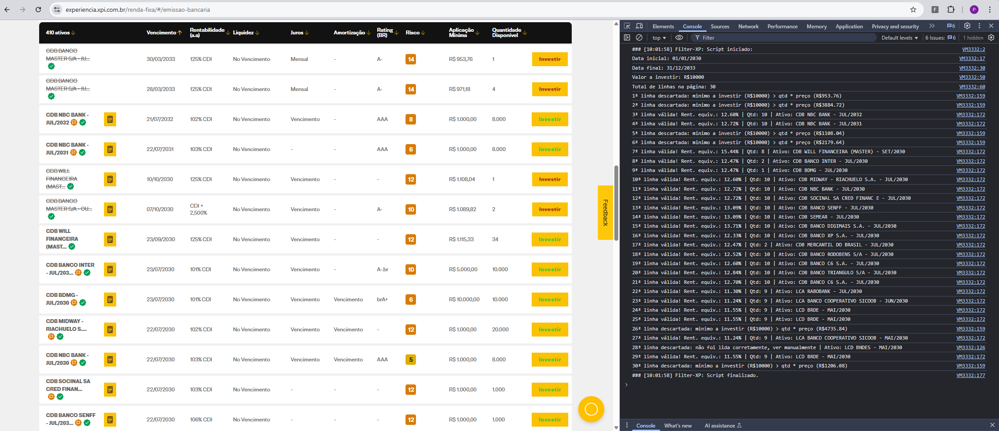

# Filter XP: Filtro de Renda Fixa para o site da corretora XP Investimentos.


Quem nunca tentou pegar aquele título de renda fixa (CDB, LCI ou LCA) com uma taxa excelente, mas não conseguiu porque demorou demais?\
Pois é, os títulos com as melhoras taxas simplesmente evaporam no site da corretora...\
Eles aparecem, próximo ao horário de abertura do pregão, e em poucos minutos não se consegue pegar mais nenhum ou apenas pequenas quantidades.\
Quando sabemos qual indexador queremos (IPC-A, CDI ou Pré-fixado) é mais fácil, pois usando a ordenação do site da XP, é possível exibir os títulos ordenados da melhor para a pior taxa, mas ainda assim 2 problemas sempre ocorriam comigo:
* os títulos com os vencimentos mais longos ficam do meio pro final da lista, e quando eu finalmente os encontrava,
* a quantidade disponível já era bem reduzida e eu não conseguia comprar o montante desejado.

E quando não sabemos qual indexador queremos?\
A busca fica ainda mais complicada, é preciso calcular a rentabilidade dos títulos com suas diferentes taxas!\
Por exemplo: hoje há títulos pagando IPC-A + 7,5% e outros 105% do CDI (atualmente IPC-A está 5,35% e o CDI 12,35%)! Quando terminamos de calcular a rentabilidade de cada um, os títulos já sumiram...

Por esses motivos, desenvolvi a ferramenta **Filter XP**, uma extensão para o navegador Google Chrome, que mostra de forma rápida e clara quais dos títulos disponíveis se encaixam no período desejado para o vencimento e quais ainda possuem uma quantidade disponível maior ou igual ao quanto quero investir. E quando estamos indecisos quanto ao indexador pegar, imprimo no console a “rentabilidade equivalente” atual dos títulos, considerando o IPC-A e o CDI atuais, agilizando a tomada de decisão.


*Screenshots* da ferramenta Filter XP em uso:


A extensão após instalada permite fixar um ícone com a letra F ao lado da barra de endereços do navegador Chorme.

## Passo-a-passo de como instalar o Filter XP: :
 1) No Chrome ir em 'Gerenciar Extensões'
 2) Habilitar 'Modo do desenvolvedor'
 3) Clicar em 'Carregar sem compactação'
 4) Selecionar a pasta onde estão os arquivos
 5) Fixar o ícone da extensão no chrome

## Passo-a-passo de como utilizar o Filter XP:
Para usar a ferramenta é necessário estar na página dos ativos de renda fixa / emissões bancárias da corretora XP Investimentos (para acessar essa página: use o menu superior do site e vá em: Produtos > Renda fixa > Emissão bancária).
1.	aplicar o filtro da própria página da XP:\
a.	Clicar em ‘Filtro’\
b.	Em ‘Indexador’ escolher: ‘Pré-fixado’, ‘Inflação’ ou ‘Pós-fixado (CDI)’
2.	clicar 2 vezes na coluna ‘Rentabilidade’ de modo que a seta fique apontando para cima, indicando que a ordenação está da maior para a menor taxa
3.	rolar a página para baixo, para que mais ativos sejam carregados e apareçam na página (o Filter XP é executado apenas nos ativos carregados na página), depois pode-se rolar para cima novamente
4.	clicar no ícone da ferramenta ao lado da barra de endereços para abri-la
5.	definir a ‘Data Inicial’ e a ‘Data Final’ (estes campos indicam a janela de tempo desejada para o vencimento do título) 
6.	definir o ‘Valor a Investir’ (que é o montante mínimo que se deseja investir em um título).
7.	Clicar em ‘Executar’


O Filter XP vai percorrer os ativos exibidos na página e avalia-los:
* os ativos que se enquadram ficam com o botão ‘Investir’ da cor verde claro.
* os ativos que não se enquadram ficam com o nome riscado e o botão ‘Investir’ vermelho escuro e riscado.

Neste caso, como os ativos estão ordenados por maior taxa, o primeiro ativo com o botão ‘Investir’ em verde, será a melhor opção.

Quando não se tem um indexador de preferência, ou deseja-se usar o ‘Pós-fixado (CDI)’, é essencial abrir o log da ferramenta onde é impresso a “rentabilidade equivalente”, que é o cálculo da rentabilidade de um ativo indexado ao IPC-A ou ao CDI usando os valores atuais destes indexadores.

> [!NOTE]
> Os valores do IPC-A e do CDI precisam ser atualizados no arquivo popup.js, linhas 38 e 39, atualmente eles estão:
```
const cdi = 12.35
const ipca = 5.35
```

O log da ferramenta é exibido no console do Chrome, para abri-lo: existe o atalho ‘Ctrl + Shift + i’ (ou clicar no ícone do navegador Chrome com 3 pontinhos na vertical (perto do ícone do Filter XP), ir na opção ‘Mais ferramentas’ > ‘Ferramentas do desenvolvedor’) e clicar na aba ‘Console’.\
Ao executar a ferramenta com o console aberto, vemos a rentabilidade equivalente dos ativos facilitando a tomada de decisão.

